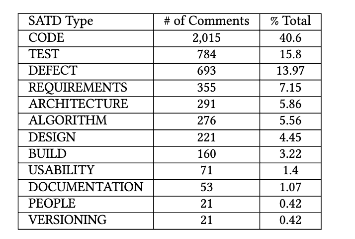

# DebtSniffer: Detecting Self-Admitted Technical Debt in R packages with CodeBERT and graph neural networks

A practical approach to the detection of SATD in R packages.

We make use of a code-embedding technique, i.e., CodeBERT, to retain the rich semantic embedded and propagated in R source code comments. Afterwards, graph convolutional networks are applied to capture the connection among scattered comment sentences, as well as to learn representations for both training data and unlabeled test data by propagating label impact through graph convolution.

## Datasets 
The dataset included SATD comments from 503 open source projects which are typically categorized into 12 TD classes.

This dataset classified and verified by [Vidoni](https://link.springer.com/article/10.1007/s10515-022-00358-6)

